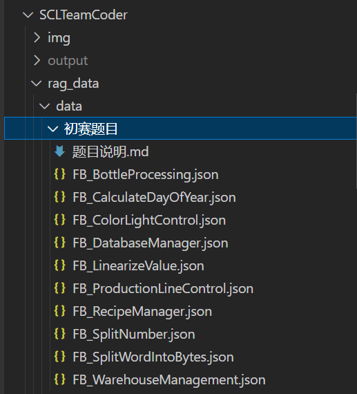
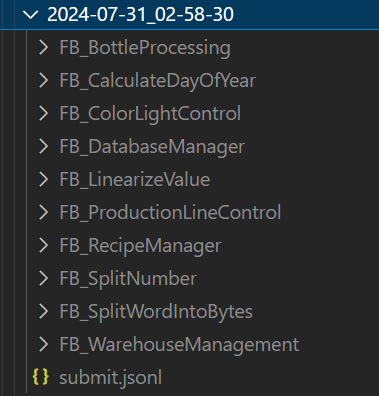
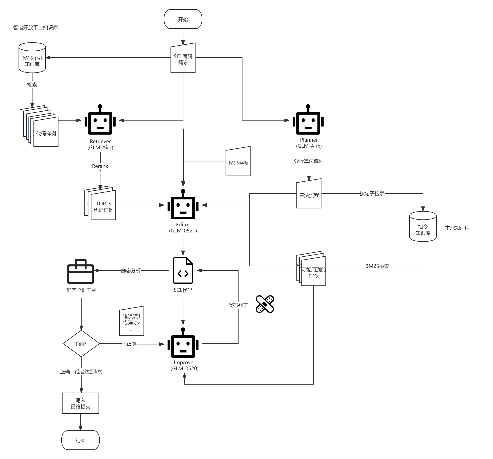

# SCLTeamCoder

 **环境配置**

使用 **ubuntu20.04** 和 **python (3.9.7)**.

- conda

```bash
$ conda create --name scl_team_coder python=3.9.7
$ conda activate scl_team_coder
$ pip install -r requirements.txt
```
- venv

```bash
$ python -m venv ./venv
$ source venv/bin/activate
$ pip install -r requirements.txt
```

-  api_key

  在`SCLTeamCoder/scl_team_coder/glovar.py`中写入你的**智谱api_key**。允许`API_KEY_0520`和`API_KEY_AIRX`相同。

**代码启动指南**

①将 **json 数据（UTF-8 BOM 格式**）放入`SCLTeamCoder/rag_data/data/初赛题目/`，就像这样：



②在根目录中提供了一个运行脚本。

```bash
$ bash run_scl_team_coder.sh
```

或直接执行命令：

```bash
$ export PYTHONPATH=$PYTHONPATH:$(pwd)
$ python -m scl_team_coder
```

脚本会依次执行所有任务,任务执行日志打印在终端。

③我们使用脚本运行的日期和时间来命名输出文件夹。在该文件夹中，**有一个名为 `submit.jsonl` 的文件，用于评估**。该文件夹还包含每个任务的日志文件子文件夹。



**SCL代码生成方式**

采用RAG(检索增强生成)和Multi-Agent(多智能体)构建执行管道。

RAG从两个知识库进行检索：

1. 指令知识库。包含指令描述、指令的输入输出参数和指令示例代码。从给定的SCL编程文档中提取。
2. 代码样例知识库，包含SCL代码样例和样例的需求描述（和初赛保持一致格式）、样例的算法流程、样例使用的指令。其中SCL代码样例基于西门子通用函数库LGF构建，样例的需求描述和算法流程使用GLM-4-0520基于样例生成。

包括以下Agent：

1. Retriever。基于智谱知识库，要求Agent根据给定的需求检索相似代码样例，并按照相似度排序。
2. Planner。根据给定需求描述算法流程。
3. Editor。根据需求、算法流程、可能用到的指令（基于算法流程从指令知识库中使用BM25检索得到）进行编码。将*相似代码样例*、*样例算法描述*、*样例用到的指令*作为few-shot进行上下文学习（In-Context Learning）。
4. Code Improver。根据静态检查结果进行纠错，输出错误代码段和对应的补丁。

使用以下工具：

1. BM25相似度计算算法。用于根据算法流程检索可能用到的指令。
2. 智谱知识库。用于根据需求检索相似代码样例。
3. SCL静态分析工具。我们基于antlr构建一个SCL语法检查器和简单的静态分析工具，能识别常见语法错误和少数语义错误。

**代码生成流程图**



1. 根据给定需求分别使用Retriever检索相似代码样例和使用Planner生成算法流程。
2. Editor基于上述结果进行编程。
3. 使用SCL代码检查代码，出现语法错误或其他错误(如使用不在指令库中的指令)，则由Improver生成代码补丁来修复。此过程循环直到没有错误或者修复次数达到阈值。
4. 将代码写入提交文件（如果存在语法错误则只输出代码模板）。

**性能优化与注意事项**

1. **根据子任务的难易度选择agent的基座模型是Airx或0520**，压缩时间开销。由于检索和算法流程分析的难度较简单，故采用airx加快速度。编程容易出错、难度大，因此采用0520版本。
2. 运行脚本会依次执行每个任务。**对单个SCL任务进行冗余编程（采用多线程，同时启动多个管道），最终选择时间<90s且通过静态检查的版本。** 如果多次修复仍无法纠正SCL代码中的全部错误，时间开销可能会超过90s。
3. 考虑到API响应速度与生成的token数量有关，**我们在Improver Agent的设置上特地采用*错误段-补丁*的生成方式**，最大程度减少需要生产的token数量。虽然很多时候我们发现*错误段-补丁*不如让模型重新生成一次完整代码，不过后者开销过大，权衡利弊我们仍然采用*错误段-补丁*的方式。
```scl
<code_segment>
<!-- 原始代码中需要修改的代码段 -->
</code_segment>
<patch>
<!-- 替换原始代码段的补丁 -->
</patch>
```
